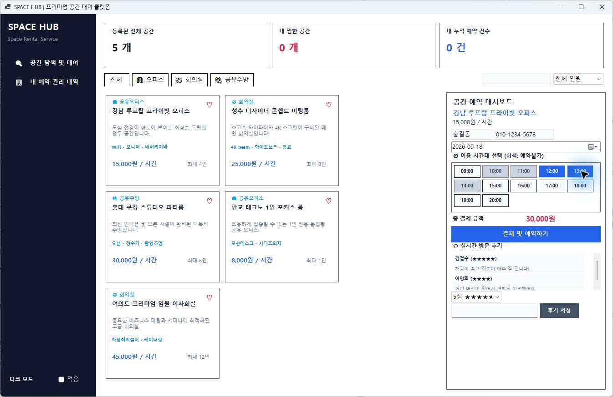
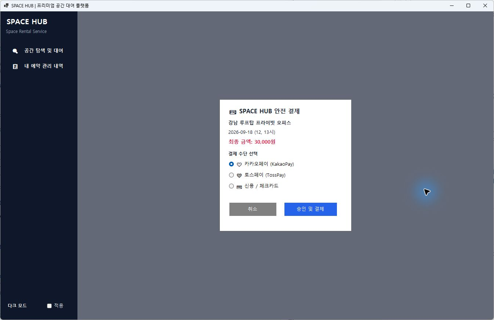

<h1 align="center">🏢 SPACE HUB — 공유공간 대여 시스템</h1>

  
  
  

  공유오피스 · 회의실 · 공유주방 
  공간 탐색부터 시간 선택, 모의 예약과 내역 관리까지

---

## 📌 프로젝트 개요

**C#과 Windows Forms로 만든 공유공간 예약 프로그램입니다.**  
공유오피스, 회의실, 공유주방을 검색하고 이용할 시간을 선택해 예약할 수 있습니다.

 

## ✨ 주요 기능

- **공간 이름과 설명 검색**, 카테고리·인원별 필터
- **공간 찜** 등록 및 해제
- **이용 시간 선택**과 요금 자동 계산
- 결제 수단 선택을 포함한 **모의 예약**
- **예약 내역 조회 및 취소**
- **별점과 후기** 작성
- **다크 모드** 전환

 

---

## 🖥️ 실행 화면

### 01. 공간 탐색 및 시간 선택

  

**회색은 이미 예약된 시간**, **파란색은 선택한 시간**입니다. 선택한 시간에 따라 총액이 바뀝니다.

 

### 02. 모의 결제

  

선택한 공간과 날짜, 시간, 금액을 확인한 뒤 결제 수단을 선택합니다. **실제 결제는 진행되지 않습니다.**

 

---

## 🔧 구현하면서 해결한 문제

### 예약된 시간을 알아보기 어려웠던 문제

**문제**

이미 예약된 시간을 화면에서 바로 확인하기 어려워, 예약 가능한 시간과 구분할 필요가 있었습니다.

**해결 방법**

공간별 예약 시간 목록을 확인해 이미 예약된 시간 버튼은 **회색으로 표시**하고, `Enabled = false`로 설정해 **선택할 수 없도록 처리**했습니다. 사용자가 선택한 시간은 파란색으로 표시했습니다.

**적용 결과**

예약이 완료되면 해당 시간도 선택할 수 없게 바뀌고, 예약을 취소하면 다시 선택할 수 있도록 처리했습니다. 이를 통해 예약 전에 이용 가능한 시간을 확인할 수 있게 했습니다.

 

## 🔄 사용 흐름

> **공간 선택 → 날짜와 시간 선택 → 금액 확인 → 모의 결제 → 예약 내역 확인**

예약 내역에서 예약자 정보와 이용 시간을 확인하거나 예약을 취소할 수 있습니다.

 

---

## 🚀 실행 방법

Windows 환경에서 .NET 6 대상 Windows Forms 프로젝트를 빌드할 수 있는 개발 환경이 필요합니다.

1. Visual Studio에서 `WinFormsApp1.sln`을 엽니다.
2. `.NET 데스크톱 개발` 구성 요소가 설치되어 있는지 확인합니다.
3. `F5`를 눌러 실행합니다.

 

## 📝 참고 사항

- 샘플 공간 5개를 사용하며, 실제 결제 서비스와는 연결되어 있지 않습니다.
- 예약·찜·후기는 메모리에 저장되므로 **프로그램을 종료하면 초기화됩니다.**
- 예약 가능 시간은 현재 공간별로 관리하며, **날짜별로 구분하는 기능은 구현하지 않았습니다.**
